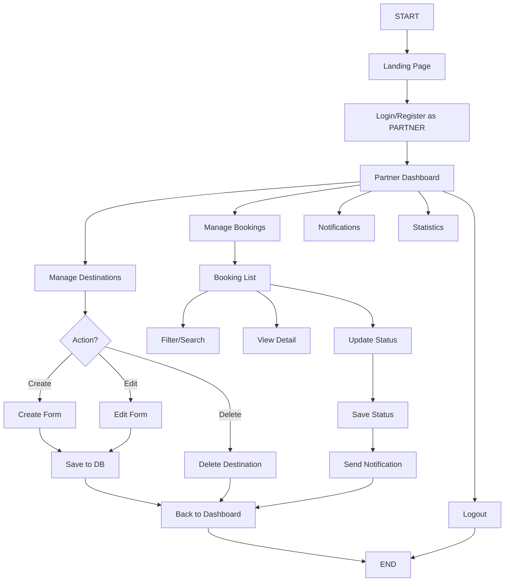

# 📊 Ringkasan Alur Partner - Platform Jejakin

## 🎯 Overview
Dokumen ini menjelaskan alur lengkap Partner (Pengelola Destinasi) dalam menggunakan platform Jejakin, dari login hingga mengelola destinasi dan booking.

---

## 🚀 Alur Utama Partner Journey

### 1️⃣ **Authentication as Partner**
```
START → Landing Page → Login/Register as PARTNER → Dashboard
```

**Detail:**
- Partner mengunjungi landing page
- Login atau Register dengan memilih role: **PARTNER**
- Setelah auth berhasil → Token disimpan → Redirect ke Dashboard
- Partner memiliki akses khusus untuk mengelola destinasi dan booking

**File Terkait:**
- `src/pages/login.tsx` - Login page
- `src/pages/register.tsx` - Register page
- `src/contexts/AuthContext.tsx` - Auth management

---

### 2️⃣ **Partner Dashboard**
```
Dashboard → [Manage Destinations | Manage Bookings | Notifications | Statistics]
```

**Fitur Dashboard:**
- 📊 Statistik bisnis (total destinasi, booking, revenue)
- 🏝️ Quick access ke kelola destinasi
- 📅 Quick access ke kelola booking
- 🔔 Notifikasi real-time
- 👤 Informasi profil partner

**File Terkait:**
- `src/pages/dashboard/index.tsx`

---

### 3️⃣ **Manage Destinations**
```
Dashboard → Manage Destinations → [Create | Edit | Delete | View]
```

**Fitur Kelola Destinasi:**
- 📋 View semua destinasi milik partner
- 🔍 Search dan filter destinasi
- ➕ Create destinasi baru
- ✏️ Edit destinasi existing
- 🗑️ Delete destinasi (soft delete)
- 👁️ View reviews dan rating

**File Terkait:**
- `src/pages/dashboard/destinations/index.tsx` - List destinations
- `src/pages/dashboard/destinations/[id].tsx` - Create/Edit form
- `src/pages/api/destinations/index.ts` - API list & create
- `src/pages/api/destinations/[id].ts` - API get, update, delete

---

### 4️⃣ **Create/Edit Destination**
```
Manage Destinations → Create/Edit Form → Submit → Save to Database
```

**Form Input Fields:**
- 📝 **Nama Destinasi** (required)
- 📍 **Alamat Lengkap** (required)
- 🗺️ **Provinsi** (required)
- 🏙️ **Kota/Kabupaten** (required)
- 📄 **Deskripsi** (required, textarea)
- 💰 **Harga per orang** (required, number)
- 🏷️ **Kategori** (required, select)
  - Pantai (BEACH)
  - Gunung (MOUNTAIN)
  - Budaya (CULTURAL)
  - Petualangan (ADVENTURE)
  - Kuliner (CULINARY)
  - Alam (NATURE)
- 🖼️ **URL Gambar** (multiple, optional)
- 🏨 **Fasilitas** (multiple, optional)
- ✅ **Status** (Active/Inactive)

**Proses Backend:**
1. Validate input data
2. Generate slug dari nama destinasi
3. Check duplicate slug
4. Save to database
5. Return success response

**File Terkait:**
- `src/pages/dashboard/destinations/[id].tsx` (form)
- `src/pages/api/destinations/index.ts` (POST)
- `src/pages/api/destinations/[id].ts` (PUT)

---

### 5️⃣ **Manage Bookings**
```
Dashboard → Manage Bookings → [View | Filter | Update Status]
```

**Fitur Kelola Booking:**
- 📋 View semua booking untuk destinasi partner
- 🔍 Search by booking code, customer name, destination
- 🏷️ Filter by status (Pending/Confirmed/Completed/Cancelled)
- 💳 Filter by payment status (Unpaid/Paid/Refunded)
- 👁️ View detail booking dan customer info
- ✏️ Update booking status
- ✏️ Update payment status
- 📊 View statistics (total, pending, confirmed, paid)

**Booking Information Displayed:**
- 🔢 Booking Code
- 👤 Customer Name, Email, Phone
- 🏝️ Destination Name
- 📅 Visit Date
- 👥 Number of People
- 💰 Total Price
- 🏷️ Booking Status
- 💳 Payment Status
- 📝 Notes from customer

**File Terkait:**
- `src/pages/dashboard/partner/bookings.tsx`
- `src/pages/api/bookings/index.ts` (GET with partner filter)
- `src/pages/api/bookings/[id].ts` (PUT for status update)

---

### 6️⃣ **Update Booking Status**
```
Booking List → Select Booking → Update Dialog → Submit → Save & Notify
```

**Status Update Options:**

**Booking Status:**
- `pending` → `confirmed` (Partner confirms booking)
- `confirmed` → `completed` (After visit date)
- Any status → `cancelled` (Cancel booking)

**Payment Status:**
- `unpaid` → `paid` (Payment received)
- `paid` → `refunded` (Refund processed)

**Proses Backend:**
1. Validate partner ownership (only update own destinations' bookings)
2. Update booking status
3. Update payment status
4. Send notification to user
5. Return success response

**File Terkait:**
- `src/pages/dashboard/partner/bookings.tsx` (dialog)
- `src/pages/api/bookings/[id].ts` (PUT)

---

### 7️⃣ **Notifications**
```
Dashboard → Notifications → [View All | Mark as Read]
```

**Jenis Notifikasi untuk Partner:**

**Partner Menerima:**
- 📅 New booking created by user
- 💳 Payment received from user
- ❌ Booking cancelled by user
- ⭐ New review added by user

**Partner Mengirim:**
- ✅ Booking confirmed
- ❌ Booking cancelled by partner
- 📝 Status updated

**File Terkait:**
- `src/pages/dashboard/notifications.tsx`
- `src/pages/api/notifications/index.ts`

---

### 8️⃣ **View Reviews**
```
Manage Destinations → View Reviews → Monitor Feedback
```

**Review Information:**
- ⭐ Rating (1-5 stars)
- 💬 Comment from user
- 👤 User name
- 📅 Review date

**File Terkait:**
- `src/pages/api/destinations/[id]/reviews.ts`

---

### 9️⃣ **Statistics Dashboard**
```
Dashboard → View Statistics
```

**Statistik yang Ditampilkan:**
- 🏝️ Total Destinations
- 📅 Total Bookings
- ⏳ Pending Bookings
- ✅ Confirmed Bookings
- 💰 Total Revenue (from paid bookings)
- 🟢 Active Destinations
- ⭐ Average Rating

**File Terkait:**
- `src/pages/dashboard/index.tsx`
- `src/pages/api/admin/bookings.ts` (with partner filter)

---

## 🔄 Alur Lengkap (End-to-End)



---

## 📱 API Endpoints yang Digunakan

### Destinations
- `GET /api/destinations` - List destinations (filtered by partner)
- `POST /api/destinations` - Create new destination
- `GET /api/destinations/{id}` - Get destination detail
- `PUT /api/destinations/{id}` - Update destination
- `DELETE /api/destinations/{id}` - Delete destination (soft delete)
- `GET /api/destinations/{id}/reviews` - Get destination reviews

### Bookings
- `GET /api/bookings` - List bookings (filtered by partner's destinations)
- `GET /api/bookings/{id}` - Get booking detail
- `PUT /api/bookings/{id}` - Update booking status
- `GET /api/admin/bookings` - Get bookings with statistics (partner access)

### Notifications
- `GET /api/notifications` - List partner notifications
- `PATCH /api/notifications/{id}` - Mark as read

### Categories
- `GET /api/categories` - List all categories (for destination form)

---

## 🎨 UI Components yang Digunakan

### Layouts
- `DashboardLayout` - Layout untuk authenticated partner

### UI Components
- `Button` - Tombol interaktif
- `Card` - Container untuk konten
- `Input` - Input field
- `Textarea` - Multi-line input
- `Select` - Dropdown select
- `Badge` - Label status
- `Table` - Tabel data booking
- `Dialog` - Modal untuk update status
- `Skeleton` - Loading placeholder

### HOC (Higher Order Component)
- `withAuthRequired` - Protect route, require authentication

---

## 🔐 Authorization & Permission

### Partner Access Rules:
1. ✅ Can create destinations
2. ✅ Can edit **own** destinations only
3. ✅ Can delete **own** destinations only
4. ✅ Can view bookings for **own** destinations only
5. ✅ Can update status for bookings of **own** destinations
6. ❌ Cannot access admin-only features
7. ❌ Cannot modify other partners' destinations

### Backend Validation:
```typescript
// Check if partner owns the destination
if (authUser.role !== 'admin' && destination.userId !== authUser.userId) {
  return res.status(403).json({ message: 'Forbidden' });
}
```

---

## 📊 Business Logic

### Destination Management:
1. **Create Destination:**
   - Generate unique slug from name
   - Set default status: active
   - Set default rating: 0
   - Associate with partner userId

2. **Edit Destination:**
   - Validate ownership
   - Update fields
   - Maintain slug (don't regenerate)

3. **Delete Destination:**
   - Soft delete (set deletedAt timestamp)
   - Don't actually remove from database
   - Hide from public listing

### Booking Management:
1. **View Bookings:**
   - Filter by partner's destinations
   - Show all statuses
   - Display customer info

2. **Update Status:**
   - Validate ownership
   - Update booking status
   - Update payment status
   - Send notification to user

3. **Status Flow:**
   ```
   pending → confirmed → completed
   any status → cancelled
   ```

4. **Payment Flow:**
   ```
   unpaid → paid → refunded
   ```

---

## 🔔 Notification Triggers

### Partner Receives Notification When:
1. User creates new booking
2. User makes payment
3. User cancels booking
4. User adds review

### User Receives Notification When:
1. Partner confirms booking
2. Partner cancels booking
3. Partner updates status

---

## 💡 Tips untuk Partner

### Best Practices:
1. ✅ Selalu update status booking secara real-time
2. ✅ Respond cepat terhadap booking pending
3. ✅ Maintain destinasi dengan informasi lengkap
4. ✅ Upload gambar berkualitas tinggi
5. ✅ Tulis deskripsi yang menarik dan informatif
6. ✅ Update fasilitas secara berkala
7. ✅ Monitor review dan feedback dari user

### Common Tasks:
- **Confirm Booking:** Pending → Confirmed
- **Complete Booking:** Confirmed → Completed (after visit)
- **Cancel Booking:** Any → Cancelled (with reason)
- **Update Payment:** Unpaid → Paid (after verification)

---

## 🚨 Error Handling

### Common Errors:
- ❌ Unauthorized access → Redirect to login
- ❌ Forbidden (not owner) → Show error message
- ❌ Destination not found → Redirect to list
- ❌ Booking not found → Show error message
- ❌ Validation failed → Show inline errors

### Error Display:
- Toast notifications (via ToastContext)
- Inline form errors
- Confirmation dialogs

---

## 📚 File Structure Summary

```
src/
├── pages/
│   ├── dashboard/
│   │   ├── index.tsx                    # Partner dashboard
│   │   ├── destinations/
│   │   │   ├── index.tsx               # List destinations
│   │   │   └── [id].tsx                # Create/Edit form
│   │   ├── partner/
│   │   │   └── bookings.tsx            # Manage bookings
│   │   └── notifications.tsx           # Notifications
│   └── api/
│       ├── destinations/
│       │   ├── index.ts                # List & Create
│       │   ├── [id].ts                 # Get, Update, Delete
│       │   └── [id]/reviews.ts         # Reviews
│       ├── bookings/
│       │   ├── index.ts                # List bookings
│       │   └── [id].ts                 # Get & Update
│       └── admin/
│           └── bookings.ts             # Bookings with stats
├── components/
│   ├── layouts/                        # Layout components
│   ├── ui/                             # UI components
│   └── hoc/                            # Higher Order Components
├── contexts/                           # React contexts
└── lib/                               # Utilities & helpers
```

---

## 🎯 Partner Goals & Success Metrics

### Primary Goals:
1. ✅ Mengelola destinasi dengan mudah
2. ✅ Menerima dan konfirmasi booking
3. ✅ Update status booking real-time
4. ✅ Monitor performa destinasi
5. ✅ Meningkatkan rating dan review

### Success Metrics:
- 📈 Booking confirmation rate
- 📈 Average response time
- 📈 Destination rating
- 📈 Total revenue
- 📈 Repeat bookings

---

**🎉 Selamat! Anda sudah memahami alur lengkap Partner di platform Jejakin.**

Gunakan flowchart XML dan dokumentasi ini sebagai referensi dalam development dan testing.
