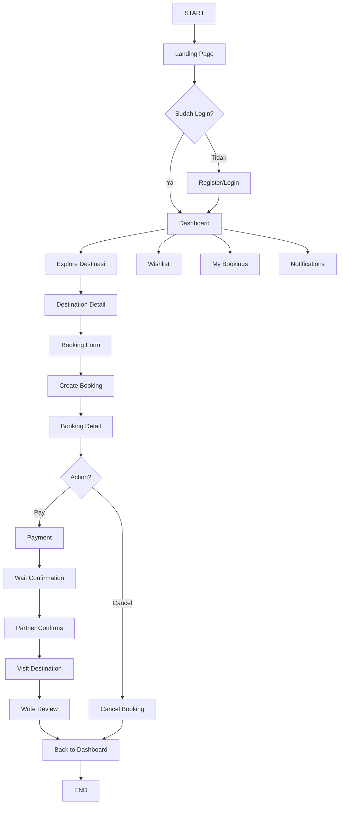

# 📊 Ringkasan Alur User - Platform Jejakin

## 🎯 Overview
Dokumen ini menjelaskan alur lengkap user (wisatawan) dalam menggunakan platform Jejakin, dari landing page hingga selesai melakukan booking dan review.

---

## 🚀 Alur Utama User Journey

### 1️⃣ **Landing & Authentication**
```
START → Landing Page → Login/Register → Dashboard
```

**Detail:**
- User mengunjungi landing page (`index.tsx`)
- Melihat fitur, destinasi populer, dan statistik platform
- Pilihan: Login atau Register
- Setelah auth berhasil → Token disimpan → Redirect ke Dashboard

**File Terkait:**
- `src/pages/index.tsx` - Landing page
- `src/pages/login.tsx` - Login page
- `src/pages/register.tsx` - Register page
- `src/contexts/AuthContext.tsx` - Auth management

---

### 2️⃣ **Dashboard User**
```
Dashboard → [Explore | My Bookings | Wishlist | Notifications]
```

**Fitur Dashboard:**
- 📊 Statistik booking (total, pending, completed, total spent)
- 📅 5 booking terbaru
- 👤 Informasi profil user
- 🔗 Quick access ke semua fitur

**File Terkait:**
- `src/pages/dashboard/index.tsx`

---

### 3️⃣ **Explore Destinasi**
```
Dashboard → Explore → [Search & Filter] → Destination List
```

**Fitur Explore:**
- 🔍 Search destinasi by name
- 🏷️ Filter by category (Pantai, Gunung, Budaya, dll)
- 📍 Filter by province
- ⭐ Lihat rating dan harga
- ❤️ Add to wishlist langsung dari list

**File Terkait:**
- `src/pages/dashboard/explore.tsx`
- `src/pages/api/destinations/index.ts`
- `src/pages/api/categories/index.ts`

---

### 4️⃣ **Destination Detail**
```
Explore → Pilih Destinasi → Destination Detail Page
```

**Informasi yang Ditampilkan:**
- 🖼️ Image gallery (multiple images)
- 📝 Deskripsi lengkap destinasi
- 🏨 Fasilitas yang tersedia
- 📍 Lokasi detail (koordinat)
- ⭐ Rating dan reviews dari user lain
- 💰 Harga per orang
- ❤️ Add to wishlist button

**File Terkait:**
- `src/pages/destinations/[slug].tsx`
- `src/pages/api/destinations/[id].ts`
- `src/pages/api/destinations/[id]/reviews.ts`

---

### 5️⃣ **Booking Process**
```
Destination Detail → Booking Form → Submit → Booking Created
```

**Booking Form Input:**
- 📅 Tanggal kunjungan (min: hari ini)
- 👥 Jumlah orang (min: 1)
- 📝 Catatan optional

**Kalkulasi Otomatis:**
```
Total Price = Harga Destinasi × Jumlah Orang
```

**Proses Backend:**
1. Generate booking code unik
2. Status: `pending`
3. Payment status: `unpaid`
4. Kirim notifikasi ke user & partner
5. Redirect ke booking detail page

**File Terkait:**
- `src/pages/destinations/[slug].tsx` (form)
- `src/pages/api/bookings/index.ts` (POST)
- `src/pages/dashboard/bookings/[id].tsx` (detail)

---

### 6️⃣ **My Bookings**
```
Dashboard → My Bookings → [All | Pending | Confirmed | Completed | Cancelled]
```

**Fitur My Bookings:**
- 📋 List semua booking dengan filter status
- 🔍 View detail booking
- ❌ Cancel booking (jika status pending)
- 💳 Payment status indicator
- 📅 Informasi tanggal kunjungan

**Status Booking:**
- `pending` - Menunggu konfirmasi partner
- `confirmed` - Dikonfirmasi partner
- `completed` - Selesai (setelah tanggal kunjungan)
- `cancelled` - Dibatalkan

**File Terkait:**
- `src/pages/dashboard/bookings/index.tsx`
- `src/pages/dashboard/bookings/[id].tsx`
- `src/pages/api/bookings/index.ts`
- `src/pages/api/bookings/[id].ts`

---

### 7️⃣ **Payment Process**
```
Booking Detail → Payment → Payment Success → Status Updated
```

**Payment Flow:**
1. User klik "Pay" di booking detail
2. Process payment via API
3. Update payment status: `unpaid` → `paid`
4. Kirim konfirmasi ke user
5. Notifikasi ke partner

**File Terkait:**
- `src/pages/api/payments/index.ts`

---

### 8️⃣ **Visit & Review**
```
Confirmed Booking → Visit Date → Visit Destination → Write Review (Optional)
```

**Review Process:**
- ⭐ Rating: 1-5 stars
- 💬 Comment/feedback
- 📊 Update destination rating otomatis
- 🔔 Notifikasi ke partner

**File Terkait:**
- `src/pages/api/destinations/[id]/reviews.ts`

---

### 9️⃣ **Wishlist Management**
```
Dashboard → Wishlist → [View | Remove | Go to Detail]
```

**Fitur Wishlist:**
- ❤️ Simpan destinasi favorit
- 📋 View semua wishlist
- 🗑️ Remove dari wishlist
- 🔗 Quick access ke destination detail

**File Terkait:**
- `src/pages/dashboard/wishlist.tsx`
- `src/pages/api/wishlists/index.ts`

---

### 🔟 **Notifications**
```
Dashboard → Notifications → [View All | Mark as Read]
```

**Jenis Notifikasi:**
- 📅 Booking created
- ✅ Booking confirmed by partner
- ❌ Booking cancelled
- 💳 Payment success
- ⭐ Review added

**File Terkait:**
- `src/pages/dashboard/notifications.tsx`
- `src/pages/api/notifications/index.ts`
- `src/components/ui/NotificationBell.tsx`
- `src/components/ui/NotificationList.tsx`

---

## 🔄 Alur Lengkap (End-to-End)



---

## 📱 API Endpoints yang Digunakan

### Authentication
- `POST /api/auth/register` - Register user baru
- `POST /api/auth/login` - Login user
- `GET /api/auth/me` - Get current user info

### Destinations
- `GET /api/destinations` - List destinations (with filters)
- `GET /api/destinations?slug={slug}` - Get destination by slug
- `GET /api/destinations/{id}/reviews` - Get destination reviews
- `POST /api/destinations/{id}/reviews` - Create review

### Bookings
- `GET /api/bookings` - List user bookings
- `POST /api/bookings` - Create new booking
- `GET /api/bookings/{id}` - Get booking detail
- `DELETE /api/bookings/{id}` - Cancel booking

### Wishlist
- `GET /api/wishlists` - List user wishlists
- `POST /api/wishlists` - Add to wishlist
- `DELETE /api/wishlists?destinationId={id}` - Remove from wishlist

### Notifications
- `GET /api/notifications` - List user notifications
- `PATCH /api/notifications/{id}` - Mark as read

### Payments
- `POST /api/payments` - Process payment

### Categories
- `GET /api/categories` - List all categories

---

## 🎨 UI Components yang Digunakan

### Layouts
- `GuestLayout` - Layout untuk guest (landing, login, register)
- `DashboardLayout` - Layout untuk authenticated user

### UI Components
- `Button` - Tombol interaktif
- `Card` - Container untuk konten
- `Input` - Input field
- `Badge` - Label status
- `Tabs` - Tab navigation
- `Skeleton` - Loading placeholder
- `WishlistButton` - Toggle wishlist
- `NotificationBell` - Notification indicator
- `NotificationList` - List notifikasi
- `StatCard` - Card statistik

### HOC (Higher Order Component)
- `withAuthRequired` - Protect route, require authentication

---

## 🔐 Authentication Flow

```
1. User input email & password
2. POST /api/auth/login or /api/auth/register
3. Backend validate & generate JWT token
4. Token disimpan di localStorage
5. Token digunakan di header: Authorization: Bearer {token}
6. Setiap request ke protected route harus include token
7. Logout: Clear token dari localStorage
```

---

## 📊 State Management

### Context API
- `AuthContext` - Manage authentication state
- `ToastContext` - Manage toast notifications

### Local State (useState)
- Form inputs
- Loading states
- Data fetching results

---

## 🎯 User Goals & Success Metrics

### Primary Goals:
1. ✅ Menemukan destinasi wisata yang sesuai
2. ✅ Booking destinasi dengan mudah
3. ✅ Melakukan pembayaran
4. ✅ Mendapat konfirmasi booking
5. ✅ Mengunjungi destinasi
6. ✅ Memberikan review

### Success Metrics:
- 📈 Conversion rate: Landing → Register
- 📈 Booking completion rate
- 📈 Payment success rate
- 📈 Review submission rate
- 📈 Repeat booking rate

---

## 🚨 Error Handling

### Common Errors:
- ❌ Authentication failed → Redirect to login
- ❌ Token expired → Refresh or re-login
- ❌ Booking failed → Show error message
- ❌ Payment failed → Retry option
- ❌ Network error → Retry button

### Error Display:
- Toast notifications (via ToastContext)
- Inline error messages
- Error pages (404, 500)

---

## 🔔 Notification System

### Trigger Events:
1. Booking created → Notify user & partner
2. Booking confirmed → Notify user
3. Booking cancelled → Notify user & partner
4. Payment success → Notify user & partner
5. Review added → Notify partner

### Notification Channels:
- In-app notifications (NotificationBell)
- Email notifications (via email service)

---

## 💡 Tips untuk Developer

### Saat Implementasi:
1. Selalu cek authentication state sebelum akses protected route
2. Gunakan `withAuthRequired` HOC untuk protect pages
3. Handle loading & error states dengan baik
4. Validasi input di frontend & backend
5. Gunakan TypeScript untuk type safety

### Saat Testing:
1. Test happy path (alur normal)
2. Test edge cases (input invalid, network error)
3. Test authentication flow
4. Test booking flow end-to-end
5. Test notification system

---

## 📚 File Structure Summary

```
src/
├── pages/
│   ├── index.tsx                    # Landing page
│   ├── login.tsx                    # Login page
│   ├── register.tsx                 # Register page
│   ├── dashboard/
│   │   ├── index.tsx               # User dashboard
│   │   ├── explore.tsx             # Explore destinations
│   │   ├── wishlist.tsx            # Wishlist page
│   │   ├── notifications.tsx       # Notifications page
│   │   └── bookings/
│   │       ├── index.tsx           # Bookings list
│   │       └── [id].tsx            # Booking detail
│   ├── destinations/
│   │   ├── index.tsx               # Destinations list
│   │   └── [slug].tsx              # Destination detail
│   └── api/                        # API routes
├── components/
│   ├── layouts/                    # Layout components
│   ├── ui/                         # UI components
│   └── hoc/                        # Higher Order Components
├── contexts/                       # React contexts
├── lib/                           # Utilities & helpers
└── types/                         # TypeScript types
```

---

**🎉 Selamat! Anda sudah memahami alur lengkap User di platform Jejakin.**

Gunakan flowchart XML dan dokumentasi ini sebagai referensi dalam development dan testing.
